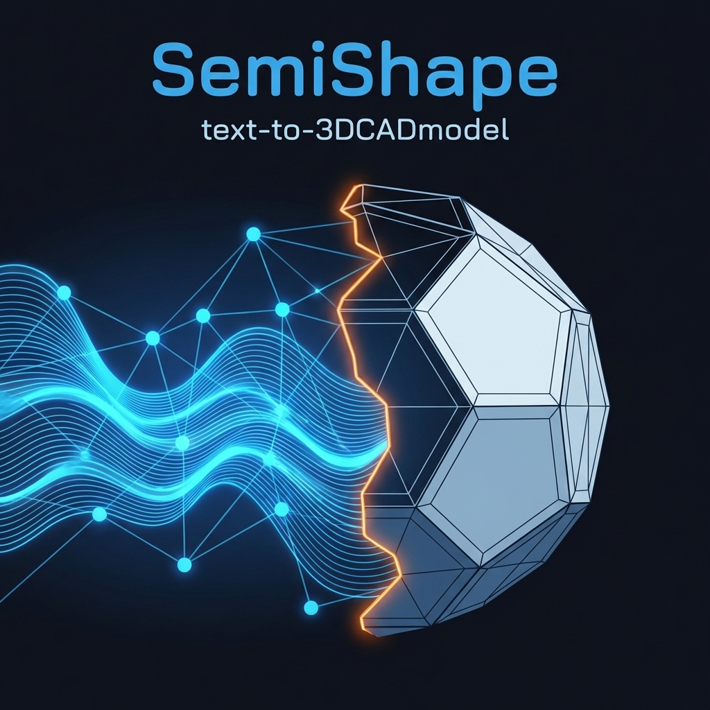

# SemiShape

<p align="center">
  
</p>

<p align="center">
  <em>"Almost a shape. Mostly suggestion."</em>
</p>

<p align="center">
  <a href="https://github.com/painter99/semishape/releases">
    
  </a>
  <a href="./LICENSE">
    
  </a>
  <a href="https://www.python.org/">
    
  </a>
  <a href="https://github.com/frdel/agent-zero">
    
  </a>
  <a href="https://github.com/gumyr/build123d">
    
  </a>
  <a href="https://github.com/painter99/semishape">
    
  </a>
</p>

<p align="center">
  🎨 <strong>Transform text descriptions into 3D parametric CAD models — right inside Agent Zero.</strong>
</p>

---

## Overview

SemiShape is a hobby plugin for [Agent Zero](https://github.com/frdel/agent-zero) that adds
AI-powered CAD generation directly to your conversations. Describe what you want in plain Czech
or English and get a build123d Python script and an STL (or STEP) file back.

> ⚙️ **Status:** Personal hobby project — actively used, actively improved. Bugs may exist.

---

## How It Works

SemiShape does **not** use a separate AI model.
It calls **whatever model you have configured as active in your Agent Zero conversation**.

```
   You                  Agent Zero              SemiShape
────────────────────────────────────────────────────────
"Create a box 50×30×10"  →  [active model]  →  build123d code
                                                      ↓
                                               sandbox execution
                                                      ↓
                                               model_abc123.stl ✅
```

The plugin provides:
- **Structured prompts** that guide the model to generate valid build123d code
- **A sandboxed executor** that runs the generated code safely in a subprocess
- **STL / STEP export** from the executed build123d model
- **Documentation search** across 600+ bundled build123d docs

---

## Features

✅ **Natural Language to 3D**  
Describe geometry in Czech or English — no special syntax needed.

✅ **Slash Commands**  
Easiest way to use SemiShape — just type `/3d` or `/cad` in chat:

```
/3d Create a 50×30×10 mm box with a centred hole
/docs how to use fillet in build123d
/export step
```

✅ **Auto-Detection**  
The model recognises CAD requests automatically and uses SemiShape proactively.

✅ **Sandbox Execution**  
Generated code runs in an isolated subprocess with a 60-second timeout.

✅ **STL and STEP Export**  
Outputs ready-to-print STL or CAD-interchange STEP files.

✅ **build123d Documentation Search**  
Search 600+ bundled doc files or the web for API examples and function reference.

✅ **No Extra Model Configuration**  
Uses the model you already have active in Agent Zero — no additional API keys or model setup.

---

## Installation

### Prerequisites

- Agent Zero (v1.0+)
- An API key already configured in Agent Zero (OpenRouter or compatible)
- Python 3.10+

### Quick Start

1. **Install the plugin in Agent Zero UI**  
   Settings → Plugins → Install Plugin → Git → `https://github.com/painter99/semishape`

2. **Enable the plugin**  
   Settings → Plugins → SemiShape → Enable

---

## Usage

### 🚀 Easiest: Slash Commands

Just type these in the Agent Zero chat — no `@` symbol or special syntax needed:

| Command | What it does |
|---------|-------------|
| `/3d <description>` | Generate a 3D model from text |
| `/cad <description>` | Same as `/3d` |
| `/model <description>` | Same as `/3d` |
| `/docs <query>` | Search build123d documentation |
| `/export <format>` | Re-export last model (`stl`, `step`, or `both`) |

**Examples:**
```
/3d Create a 50×30×10 mm box with a 5 mm centred hole
/3d Vytvoř kvádr 50×30×10 mm s dírou průměru 5 mm uprostřed
/docs how to apply fillet to edges
/export step
/export both
```

### 🎯 Natural Language (Auto-Detection)

You can also just describe what you want — SemiShape will be used automatically:

```
Create a mounting bracket for two M3 screws
I need a 3D printable box for a Raspberry Pi
Model a simple gear with 20 teeth
```

### ⚙️ Advanced: Direct Tool Calls

```
@semishape_generate description="Create a 50×30×10 mm box with a 5 mm centred hole" language="en"
@semishape_execute code="from build123d import *\nwith BuildPart() as p:\n    Box(50, 30, 10)" export_format="stl"
@semishape_rag_search query="how to use fillet"
```

---

## Tools Reference

### `@semishape_generate`

| Parameter | Required | Default | Description |
|-----------|----------|---------|-------------|
| `description` | ✅ | — | Text description of the model (Czech or English) |
| `language` | ❌ | `cs` | Language for generated code comments: `cs` \| `en` |
| `execute` | ❌ | `true` | Also execute and export STL |

> **Model:** Uses the currently active Agent Zero model. To change the model,
> switch it in your Agent Zero settings.

### `@semishape_execute`

| Parameter | Required | Default | Description |
|-----------|----------|---------|-------------|
| `code` | ✅ | — | build123d Python code to execute |
| `output_name` | ❌ | `model` | Output filename stem (without extension) |
| `export_format` | ❌ | `stl` | `stl`, `step`, or `both` |

### `@semishape_rag_search`

| Parameter | Required | Default | Description |
|-----------|----------|---------|-------------|
| `query` | ✅ | — | Natural language search query |
| `top_k` | ❌ | `5` | Number of results (1–10) |
| `use_web` | ❌ | `true` | Also search the web |

---

## Examples

See the [`examples/`](./examples/) directory for real screenshots and example STL files.

### Plate with spherical feet

```
/3d Create a 55×35×8 mm plate with a 30 mm cylindrical hole in the centre
and hemispherical feet (r=5 mm) in the corners
```

Result: 3D model, ~5 900 triangles, 1.5 MB STL — see [examples/README.md](./examples/README.md).

---

## Configuration

Default settings are in `default_config.yaml`. You can override them per-project in  
`.a0proj/plugins/semishape/config.yaml`.

Key settings:

```yaml
# Directory where generated files are saved
output_dir: "/a0/usr/projects/semishape/output"

# Subprocess timeout in seconds
execution_timeout: 60

# Default export format: stl | step
default_export_format: "stl"

# Default language for code comments: cs | en
default_language: "cs"
```

> **Note:** There is no model configuration — SemiShape uses whatever model is active
> in your Agent Zero conversation.

---

## Project Structure

```
semishape/
├── plugin.yaml              # Agent Zero plugin manifest
├── default_config.yaml      # Default settings
├── hooks.py                 # Plugin lifecycle (install / uninstall)
├── initialize.py            # Dependency installer
├── README.md
│
├── tools/
│   ├── semishape_generate.py   # Text → CAD code + STL
│   ├── semishape_execute.py    # Execute build123d code → STL/STEP
│   └── semishape_rag_search.py # Search build123d docs
│
├── helpers/
│   └── tool.py              # Base Tool and Response classes
│
├── src/
│   ├── generation/
│   │   └── prompts.py       # build123d system prompts and inference rules
│   ├── execution/
│   │   ├── sandbox.py       # Subprocess execution sandbox
│   │   └── exporter.py      # STL / STEP export helpers
│   └── rag/                 # Documentation retrieval pipeline
│
├── data/docs/               # 600+ build123d documentation files
├── output/                  # Generated STL / STEP files (gitignored)
├── examples/                # Usage screenshots and example models
├── prompts/                 # Tool system prompts for Agent Zero
├── skills/                  # Agent Zero skill definition
└── extensions/              # Agent Zero agent-init extension
```

---

## Troubleshooting

**Plugin not visible in Agent Zero UI**  
Settings → Plugins → look under the Custom tab, not the Browse (hub) tab.

**API key not found**  
Set `API_KEY_OPENROUTER` in your environment or in Agent Zero secrets.

**build123d not installed**  
Re-enable the plugin to trigger the installer, or run `python initialize.py` in the plugin directory.

**Generated code fails to execute**  
Try rephrasing the description with explicit dimensions. You can also use `/docs` to look up the
relevant API before generating:

```
/docs how to create a cylindrical hole
```

**Slash commands not working**  
Make sure the plugin is enabled and the agent has been restarted after enabling.

---

## Contributing

This is a personal hobby project — contributions and issue reports are welcome!

Please check the [TESTING.md](./TESTING.md) guide for instructions on how to set up
a test environment for the plugin.

---

## License

Apache License 2.0 — see [LICENSE](./LICENSE).

---

## Attribution

> Maitland, R. (2025). *build123d: A Python-based parametric CAD library* (v0.10.0).  
> DOI: [10.5281/zenodo.17537673](https://doi.org/10.5281/zenodo.17537673)

> ⚠️ SemiShape is an unofficial community tool — not affiliated with, sponsored by, or
> endorsed by the build123d or Agent Zero core teams. Always verify AI-generated geometry
> before manufacturing.
