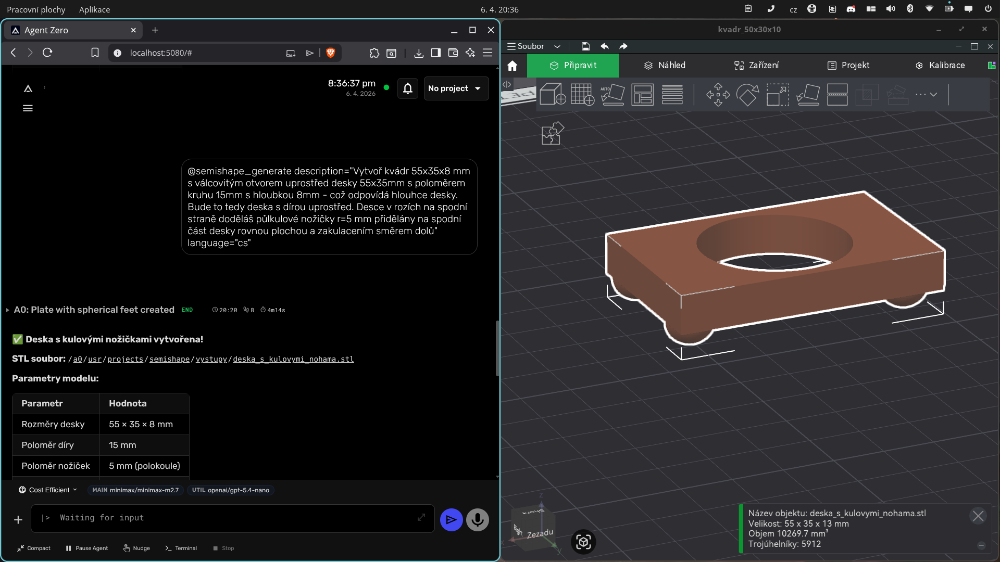
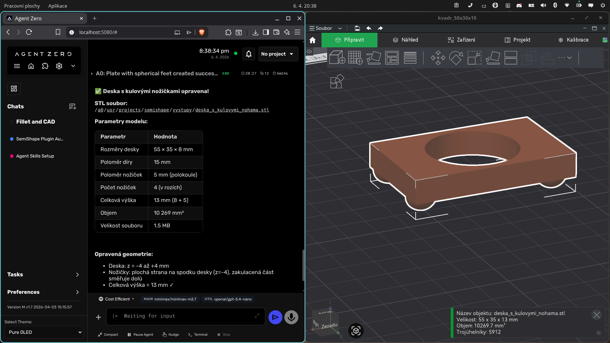

# SemiShape Examples

Real examples of SemiShape generating 3D CAD models from text descriptions.

---

## Example 1: Plate with Spherical Feet

**Language:** Czech  
**Model used:** minimax/minimax-m2.7 (Agent Zero's active model)

### Input
```
@semishape_generate description="Vytvoř kvádr 55x35x8 mm s válcovitým otvorem uprostřed desky
55x35mm s poloměrem kruhu 15mm s hloubkou 8mm - což odpovídá hloubce desky. Bude to tedy deska
s dírou uprostřed. Desce v rozích na spodní straně dodělás půlkulové nožičky r=5 mm přidělány
na spodní část desky rovnou plochou a zakulacením směrem dolů" language="cs"
```

### Generation process



*Agent Zero processing the Czech description and generating build123d Python code*

### Result



*Final 3D model STL opened in Bambu Studio for a 3D printing.*

### Parameters

| Parameter | Value |
|-----------|-------|
| Plate dimensions | 55 × 35 × 8 mm |
| Hole radius | 15 mm |
| Foot radius | 5 mm (half-sphere) |
| Number of feet | 4 (in corners) |
| Total height | 13 mm (8 + 5) |
| Volume | 10 269 mm³ |
| STL file size | 1.5 MB |
| Triangle count | 5 912 |

### Output file
```
deska_s_kulovymi_nohama.stl
```

---

## Notes

- SemiShape uses the AI model that is currently active in your Agent Zero conversation
- Czech and English descriptions both work well
- Complex geometry (holes + feet) is handled automatically
- Output is a valid STL file ready for 3D printing or further CAD processing
